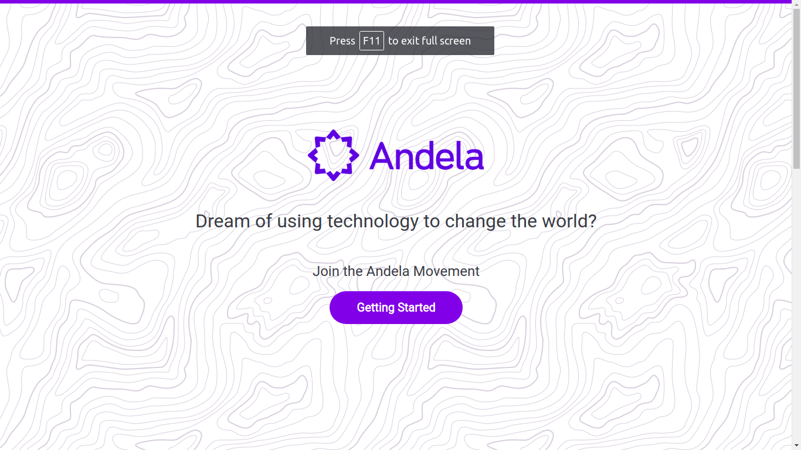
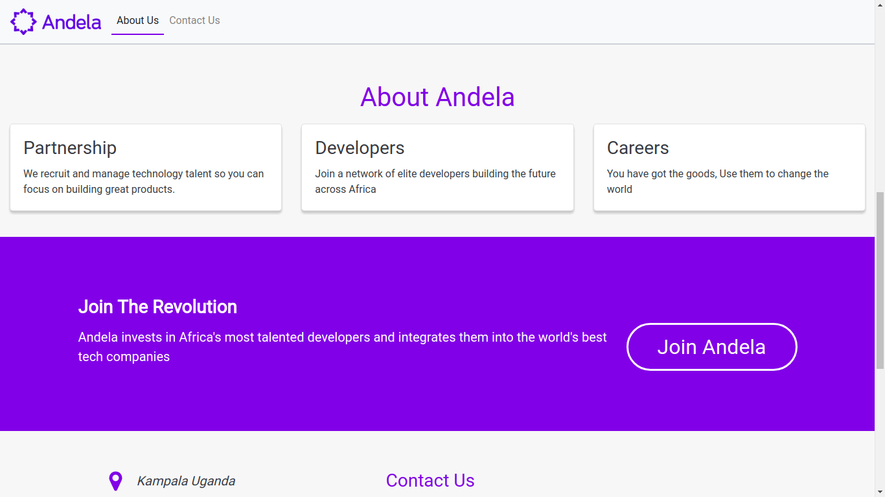

# [Aspiring Adelans](https://aspiringandelans.slack.com/) Challenge 1

In a certain [slack](https://aspiringandelans.slack.com/) group for aspiring
Adelan's,

## A working demo can be found [here](https://krmroland.github.io/bootstrap-slack-challenge/)

* The challenge one was as follows.
  * Create a github repo for this task. Create a branch name it gh-pages and
    push
  * your code to this branch of the repo. Create a one page webpage template
    project
  * using either materialize or bootstrap 4. You can add your own custom css and
  * Javascript (es6 and above). Features of the site. A welcome banner An about
    us section A contact form.

### Here is the screen shot for index page

 ,

### Here is the screen shot for the about page

 ,

**I used modern front end development tools like
[handlebars](http://handlebarsjs.com/) for templating and
[webpack](https://webpack.js.org/) for module bundling**

## Getting Started

> **Note:** If you don't want to re-build the project, you may just clone this
> branch directly `https://github.com/krmroland/bootstrap-slack-challenge.git`
> or simply vist the dist folder after you have cloned this repo

### 1. [Download ZIP](https://github.com/krmroland/bootstrap-slack-challenge.git) or git Clone https://github.com/krmroland/bootstrap-slack-challenge.git

### 2. Build the project

The cloned/downloaded repository contains prebuilt version of the project in the
dist directory . But you may want to rebuild it on your own.

You need to have [NodeJs](https://nodejs.org/en/) with npm or yarn.

Install npm dependencies

```sh
npm install or yarn
```

## Building the project and start local web server

```
npm run start
```

Open the project [http://localhost:8080](http://localhost:4000).

**Warning!** All changes made in `dist/` folder are overwritten on every
application build

## Without a web server

```
npm run watch
```

And then got to the dist directory and open the index.html page like you
normally would for other pages

## Minimizing Code for production

You will want to optimize your builds in production like minifying assets.

```
npm run production
```

:wink: Have Fun
